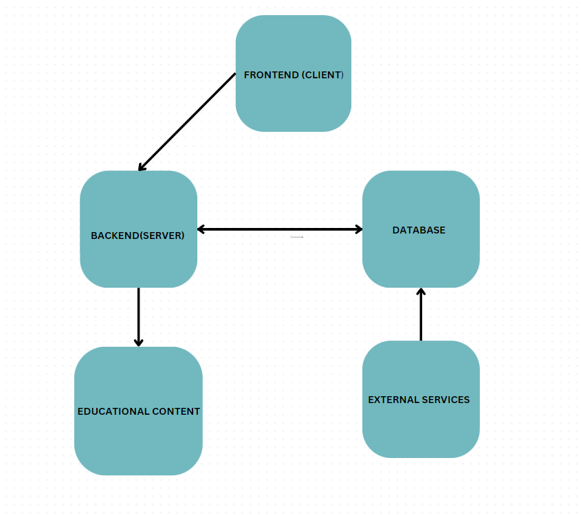
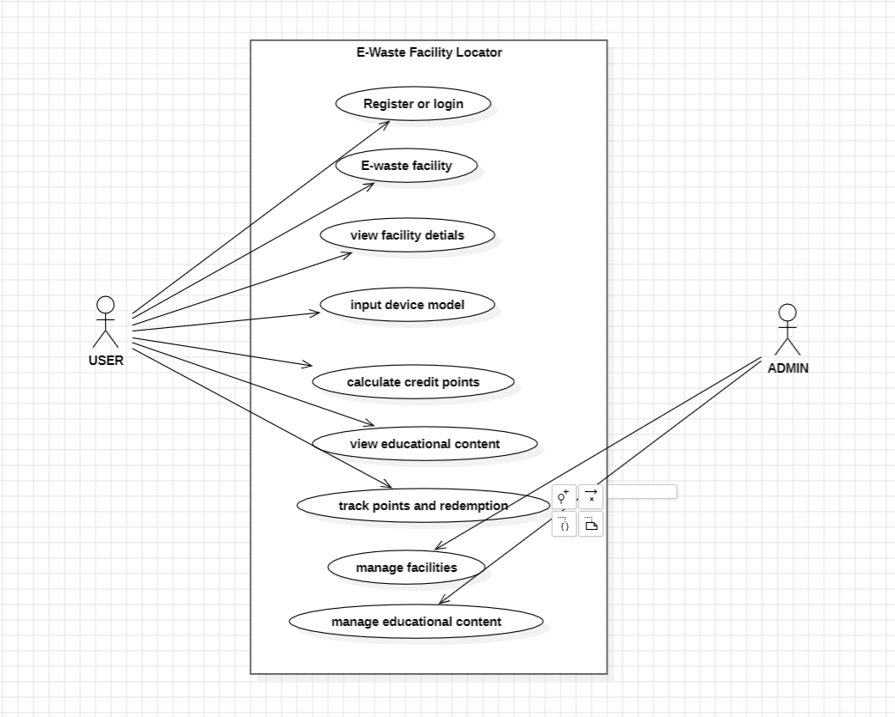

# Smart India Hackathon Workshop
# Date : 17/05/2024
## Register Number : 212221243002
## Name            : Sanjay S
## Problem Title
E-Waste Facility Locator
## Problem Description
Website that tells you the location of the nearest e-waste collection and recycling facility. Offers educational pop-ups on the harmful components of your e-waste and their effects on the environment and human health if not disposed correctly. There could be an option to input the model of your old device and earn credit points relative to the amount of precious metals recovered from the device if disposed correctly.
## Problem Creater's Organization
Ministry of Environment

## Idea
The idea is to create a user-friendly platform that addresses the increasing problem of e-waste by promoting proper disposal practices. By providing location-based services, educational content, and an incentive system, the platform aims to increase public awareness and participation in e-waste recycling, thereby reducing environmental pollution and health risks.

## Proposed Solution / Architecture Diagram

## Use Cases

## Technology Stack
### Frontend
#### React.js:
For building the user interface.
#### Google Maps API: 
For displaying the map and locating facilities.

### Backend

#### Node.js:
For server-side logic.
#### Express.js: 
For creating API endpoints and handling requests.

### Database
#### MongoDB: 
For storing user data, facility details, device models, and transactions.

### Authentication
#### OAuth 2.0: 
For secure user authentication (e.g., using Google or Facebook login).

## Dependencies
### Frontend
#### React: 
Library for building user interfaces.
#### Axios: 
For making API requests.
#### Google Maps API: 
For geolocation services.

### Backend
#### Node.js: 
JavaScript runtime for server-side programming.
#### Express.js: 
Framework for building web applications.
#### Mongoose: 
For interacting with MongoDB.

### Database
#### MongoDB: 
NoSQL database for storing application data.

### Authentication
#### Passport.js: 
Middleware for handling authentication.

### Other Dependencies
#### Dotenv: 
For managing environment variables.
#### Bcrypt: 
For hashing passwords.
#### Jsonwebtoken: 
For creating and verifying JSON Web Tokens (JWTs).

This comprehensive solution aims to effectively manage e-waste disposal, educate users, and incentivize proper recycling practices, ultimately contributing to environmental sustainability.
